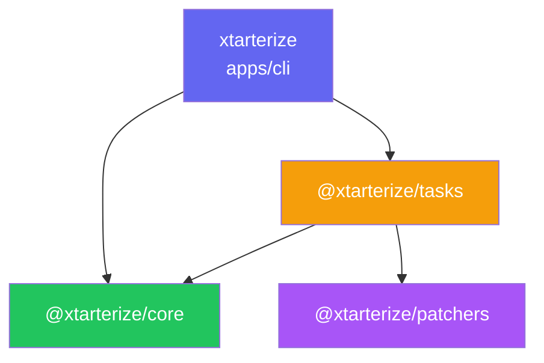
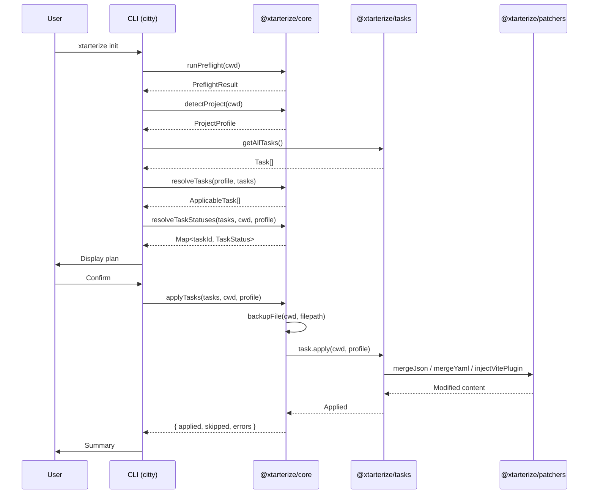
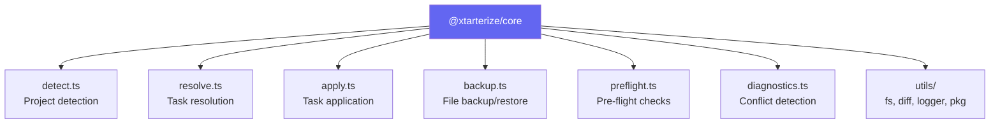
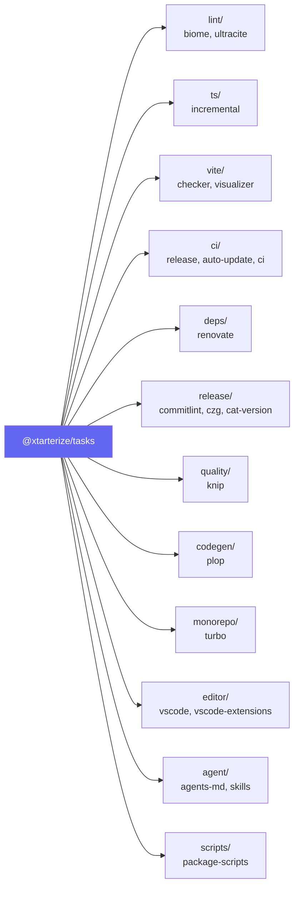

import { Aside, FileTree, Tabs, TabItem, LinkButton } from '@astrojs/starlight/components'

# Architecture Overview

Xtarterize is organized as a monorepo using Turborepo for task orchestration and pnpm for package management.

## Package Structure

<FileTree>
- packages/
  - core/ — @xtarterize/core — Detection, task interface, utils, backup
  - patchers/ — @xtarterize/patchers — JSON/YAML merge, AST patching
  - tasks/ — @xtarterize/tasks — All conformance task implementations
- apps/
  - cli/ — **xtarterize** — CLI binary (citty + @clack/prompts)
  - docs/ — @xtarterize/docs — This documentation site (Astro/Starlight)
- test/
  - fixtures/ — Test fixtures for various project types
</FileTree>

## Package Dependencies



<Aside>
  `@xtarterize/patchers` and `@xtarterize/core` have no internal workspace dependencies — they are leaf packages that can be used independently.
</Aside>

## How It Works



## Key Design Decisions

- **Detection lives in core** — No CLI dependency, reusable by other consumers
- **Tasks are independent** — Each task can run standalone via `add <task-id>`
- **Dry-run is exact** — `dryRun()` output is bit-for-bit identical to what `apply()` writes
- **Idempotency is non-negotiable** — Running twice produces no changes on second run
- **Templates are parameterized** — All templates receive `ProjectProfile` and adapt accordingly

## Core Modules



## Task Categories



## Development Workflow

<Tabs>
  <TabItem label="Setup">
    ```bash
    # Install dependencies
    pnpm install
    ```
  </TabItem>
  <TabItem label="Build">
    ```bash
    # Build all packages
    pnpm build
    ```
  </TabItem>
  <TabItem label="Test">
    ```bash
    # Run tests
    pnpm test:run
    ```
  </TabItem>
  <TabItem label="Develop">
    ```bash
    # Start development (watch mode)
    pnpm dev
    ```
  </TabItem>
</Tabs>

<LinkButton href="/contributing/core/detect/">Explore project detection →</LinkButton>
