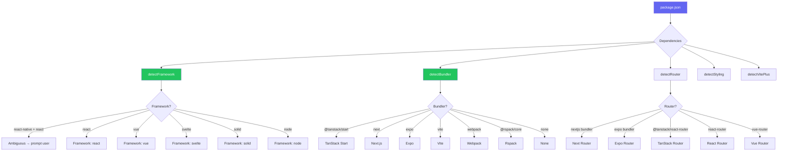

import { Aside, Tabs, TabItem } from '@astrojs/starlight/components'

# Project Detection

The `@xtarterize/core` package provides the `detectProject()` function — the foundation of Xtarterize's context-aware behavior.

## Overview

Project detection is the first step in every Xtarterize command. It analyzes your project directory to build a `ProjectProfile` that drives which conformance tasks are applicable.

## detectProject Function

```typescript
import { detectProject } from '@xtarterize/core'

const profile = await detectProject('/path/to/project')
```

## ProjectProfile Schema

The detection returns a `ProjectProfile` object:

```typescript
interface ProjectProfile {
  // Framework
  framework: 'react' | 'react-native' | 'vue' | 'svelte' | 'solid' | 'node' | null
  frameworkVersion: string | null

  // Bundler
  bundler: 'vite' | 'nextjs' | 'tanstack-start' | 'expo' | 'webpack' | 'rspack' | 'none' | null

  // Router
  router: 'tanstack-router' | 'react-router' | 'next' | 'expo-router' | 'vue-router' | null

  // Styling
  styling: ('tailwind' | 'css-modules' | 'styled-components' | 'vanilla-extract' | 'nativewind' | 'vanilla')[]

  // Language & Runtime
  typescript: boolean
  runtime: 'browser' | 'node' | 'edge' | 'native' | 'universal'

  // Package manager
  packageManager: 'npm' | 'pnpm' | 'yarn' | 'bun'

  // Repo structure
  monorepo: boolean
  monorepoTool: 'turbo' | 'nx' | 'lerna' | null
  workspaceRoot: boolean

  // Git
  hasGitHub: boolean
  hasGit: boolean

  // Existing config presence
  existing: {
    biome: boolean
    tsconfig: boolean
    renovate: boolean
    commitlint: boolean
    knip: boolean
    plop: boolean
    turbo: boolean
    vscodeSettings: boolean
    agentsMd: boolean
    githubWorkflows: string[]
  }
}
```

## Detection Logic



## Detection Sources

<Tabs>
  <TabItem label="Dependencies">
    | Signal | Source |
    |--------|--------|
    | Framework | `package.json` dependencies (`react`, `vue`, `react-native`, etc.) |
    | Bundler | `vite`, `next`, `expo`, `webpack`, `@rspack/core` in deps |
    | Router | `@tanstack/react-router`, `react-router-dom`, `vue-router` in deps |
    | Styling | `tailwindcss`, `styled-components`, `nativewind` in deps |
  </TabItem>
  <TabItem label="Filesystem">
    | Signal | Source |
    |--------|--------|
    | TypeScript | `tsconfig.json` existence, `typescript` in deps |
    | Package manager | Lockfile presence (`pnpm-lock.yaml`, `yarn.lock`, etc.) |
    | Monorepo | `pnpm-workspace.yaml`, `turbo.json`, `packages/` + `apps/` dirs |
    | GitHub | `.github/` directory presence |
  </TabItem>
</Tabs>

## Ambiguity Handling

<Aside type="note">
  When both `react` and `react-native` are present in dependencies, `detectProject()` returns `framework: null`. The CLI layer then prompts the user to clarify which describes the project. In `--quiet` mode, it defaults to `react`.
</Aside>

## Example

```typescript
const profile = await detectProject('/path/to/project')

if (profile.bundler === 'vite' && profile.typescript) {
  // Vite plugin tasks will be applicable
}

if (profile.monorepo && profile.monorepoTool === 'turbo') {
  // Turbo task may be skip if already configured
}
```
