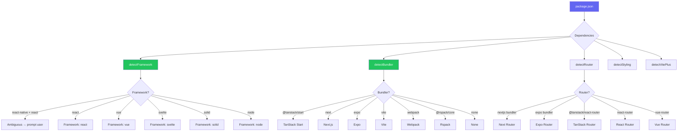

import { Aside, Tabs, TabItem } from '@astrojs/starlight/components'

The `@xtarterize/core` package provides the `detectProject()` function — the foundation of xtarterize's context-aware behavior. It analyzes your project directory to build a [`ProjectProfile`](https://github.com/agustinusnathaniel/xtarterize/blob/main/packages/core/src/detect.ts) that drives which conformance tasks are applicable.

## Overview

Project detection is the first step in every xtarterize command. It analyzes your project directory to build a `ProjectProfile` that drives which conformance tasks are applicable.

## detectProject Function

```typescript
import { detectProject } from '@xtarterize/core'

const profile = await detectProject('/path/to/project')
```

## ProjectProfile Schema

The detection returns a `ProjectProfile` object:

```typescript
interface ProjectProfile {
  // Framework
  framework: 'react' | 'react-native' | 'vue' | 'svelte' | 'solid' | 'node' | null
  frameworkVersion: string | null

  // Bundler
  bundler: 'vite' | 'nextjs' | 'tanstack-start' | 'expo' | 'webpack' | 'rspack' | 'none' | null

  // Router
  router: 'tanstack-router' | 'react-router' | 'next' | 'expo-router' | 'vue-router' | null

  // Styling
  styling: ('tailwind' | 'css-modules' | 'styled-components' | 'vanilla-extract' | 'nativewind' | 'vanilla')[]

  // Language & Runtime
  typescript: boolean
  runtime: 'browser' | 'node' | 'edge' | 'native' | 'universal'

  // Package manager
  packageManager: 'npm' | 'pnpm' | 'yarn' | 'bun'

  // Repo structure
  monorepo: boolean
  monorepoTool: 'turbo' | 'nx' | 'lerna' | null
  workspaceRoot: boolean

  // Git
  hasGitHub: boolean
  hasGit: boolean

  // Existing config presence
  existing: {
    biome: boolean
    tsconfig: boolean
    renovate: boolean
    commitlint: boolean
    knip: boolean
    plop: boolean
    turbo: boolean
    vscodeSettings: boolean
    agentsMd: boolean
    githubWorkflows: string[]
    viteConfig: boolean
    versionrc: boolean
    gitignore: boolean
  }
}
```

## Detection Logic



## Detection Sources

<Tabs>
  <TabItem label="Dependencies">
    | Signal | Source |
    |--------|--------|
    | Framework | [`package.json`](https://docs.npmjs.com/cli/v10/configuring-npm/package-json) dependencies ([`react`](https://react.dev/), [`vue`](https://vuejs.org/), [`react-native`](https://reactnative.dev/), etc.) |
    | Bundler | [`vite`](https://vitejs.dev/), [`next`](https://nextjs.org/), [`expo`](https://expo.dev/), [`webpack`](https://webpack.js.org/), [`@rspack/core`](https://rspack.dev/) in deps |
    | Router | [`@tanstack/react-router`](https://tanstack.com/router/latest), [`react-router-dom`](https://reactrouter.com/), [`vue-router`](https://router.vuejs.org/) in deps |
    | Styling | [`tailwindcss`](https://tailwindcss.com/), [`styled-components`](https://styled-components.com/), [`nativewind`](https://www.nativewind.dev/) in deps |
  </TabItem>
  <TabItem label="Filesystem">
    | Signal | Source |
    |--------|--------|
    | TypeScript | [`tsconfig.json`](https://www.typescriptlang.org/tsconfig/) existence, `typescript` in deps |
    | Package manager | Lockfile presence ([`pnpm-lock.yaml`](https://pnpm.io/), [`yarn.lock`](https://yarnpkg.com/), etc.) |
    | Monorepo | [`pnpm-workspace.yaml`](https://pnpm.io/workspaces), [`turbo.json`](https://turbo.build/repo/docs), `packages/` + `apps/` dirs |
    | GitHub | [`.github/`](https://docs.github.com/en/actions) directory presence |
  </TabItem>
</Tabs>

## Ambiguity Handling

<Aside type="note">
  When both `react` and `react-native` are present in dependencies, `detectProject()` returns `framework: null`. The CLI layer then prompts the user to clarify which describes the project. In `--quiet` mode, it defaults to `react`.
</Aside>

## Example

```typescript
const profile = await detectProject('/path/to/project')

if (profile.bundler === 'vite' && profile.typescript) {
  // Vite plugin tasks will be applicable
}

if (profile.monorepo && profile.monorepoTool === 'turbo') {
  // Turbo task may be skip if already configured
}
```

## References

- [npm package.json Documentation](https://docs.npmjs.com/cli/v10/configuring-npm/package-json) — Package manifest format
- [React](https://react.dev/) — UI library for web and native apps
- [Vue.js](https://vuejs.org/) — Progressive JavaScript framework
- [React Native](https://reactnative.dev/) — Native app development with React
- [Vite](https://vitejs.dev/) — Next-generation frontend build tool
- [Next.js](https://nextjs.org/) — React framework for production
- [TanStack Router](https://tanstack.com/router/latest) — Type-safe routing for React
- [React Router](https://reactrouter.com/) — Declarative routing for React
- [Vue Router](https://router.vuejs.org/) — Official router for Vue.js
- [Expo](https://expo.dev/) — React Native framework
- [Webpack](https://webpack.js.org/) — Module bundler
- [Rspack](https://rspack.dev/) — Fast Rust-based web bundler
- [Tailwind CSS](https://tailwindcss.com/) — Utility-first CSS framework
- [Styled Components](https://styled-components.com/) — CSS-in-JS for React
- [NativeWind](https://www.nativewind.dev/) — Tailwind CSS for React Native
- [pnpm Workspaces](https://pnpm.io/workspaces) — Monorepo workspace support
- [Turborepo](https://turbo.build/repo/docs) — Monorepo task runner
- [TypeScript tsconfig](https://www.typescriptlang.org/tsconfig/) — Compiler configuration
