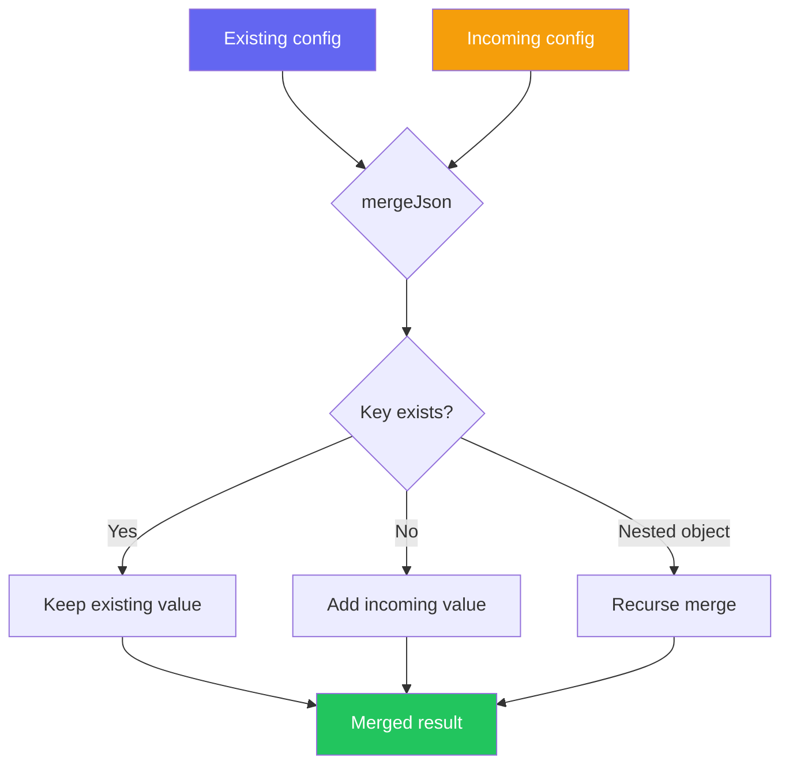

import { Aside, Tabs, TabItem } from '@astrojs/starlight/components'

The `mergeJson` function performs a deep merge of two JavaScript objects using the [`defu`](https://github.com/unjs/defu) library. It's used whenever xtarterize needs to modify JSON configuration files like [`tsconfig.json`](https://www.typescriptlang.org/tsconfig/), [`biome.json`](https://biomejs.dev/reference/configuration/), or [`.vscode/settings.json`](https://code.visualstudio.com/docs/getstarted/settings).

## Usage

```typescript
import { mergeJson } from '@xtarterize/patchers'

const existing = { compilerOptions: { strict: true, target: "ES2022" } }
const incoming = { compilerOptions: { incremental: true } }

const merged = mergeJson(existing, incoming)
// { compilerOptions: { strict: true, target: "ES2022", incremental: true } }
```

## Parameters

| Parameter | Type | Description |
|-----------|------|-------------|
| `existing` | `object` | The current configuration (takes precedence) |
| `incoming` | `object` | The new configuration to merge in (fills gaps) |

## Return Value

Returns the merged `object`. Existing keys always take precedence over incoming keys.

## Deep Merge Behavior

Nested objects are merged recursively. Existing keys take precedence, missing keys are filled from incoming:

```typescript
const existing = {
  compilerOptions: {
    strict: true,        // https://www.typescriptlang.org/tsconfig/#strict
    target: "ES2022"     // https://www.typescriptlang.org/tsconfig/#target
  }
}

const incoming = {
  compilerOptions: {
    incremental: true,           // https://www.typescriptlang.org/tsconfig/#incremental
    tsBuildInfoFile: ".tsbuildinfo"  // https://www.typescriptlang.org/tsconfig/#tsBuildInfoFile
  }
}

const merged = mergeJson(existing, incoming)
// {
//   compilerOptions: {
//     strict: true,           // preserved from existing
//     target: "ES2022",       // preserved from existing
//     incremental: true,      // added from incoming
//     tsBuildInfoFile: ".tsbuildinfo"  // added from incoming
//   }
// }
```

### Object vs Array Merge

| Type | Behavior | Example |
|------|----------|---------|
| **Objects** | Deep merge, existing keys win | `{ a: { b: 1 } }` + `{ a: { c: 2 } }` → `{ a: { b: 1, c: 2 } }` |
| **Arrays** | Replace entirely | `{ rules: ["a"] }` + `{ rules: ["b"] }` → `{ rules: ["b"] }` |

## Merge Flow



## Array Handling

<Aside type="caution">
  Arrays are **replaced**, not concatenated. xtarterize uses a custom `createDefu` callback to overwrite arrays rather than merging them (which would produce duplicates like `[100, 100]`).
</Aside>

```typescript
const existing = { plugins: ['pluginA'] }
const incoming = { plugins: ['pluginB'] }

const merged = mergeJson(existing, incoming)
// { plugins: ['pluginB'] } — incoming replaces existing array
```

For cases where arrays need to be combined (like [VS Code extension recommendations](https://code.visualstudio.com/docs/editor/extension-marketplace#_workspace-recommended-extensions)), use a custom merge function instead of `mergeJson`.

## Real-World Examples

<Tabs>
  <TabItem label="tsconfig.json">
    ```typescript
    // Existing
    const existing = { compilerOptions: { strict: true, target: "ES2022" } }
    // Incoming: add incremental builds
    const incoming = { compilerOptions: { incremental: true } }
    // Result: both preserved
    ```
  </TabItem>
  <TabItem label="biome.json">
    ```typescript
    // Existing
    const existing = { linter: { enabled: true } }
    // Incoming: add formatter
    const incoming = { formatter: { enabled: true } }
    // Result: both sections present
    ```
  </TabItem>
  <TabItem label=".vscode/settings.json">
    ```typescript
    // Existing
    const existing = { "editor.formatOnSave": true }  // https://code.visualstudio.com/docs/editor/codebasics#_format-on-save
    // Incoming: add Biome formatter
    const incoming = { "[typescript]": { "editor.defaultFormatter": "biomejs.biome" } }  // https://code.visualstudio.com/docs/getstarted/settings#_language-specific-editor-settings
    // Result: both settings preserved
    ```
  </TabItem>
</Tabs>

## References

- [defu GitHub Repository](https://github.com/unjs/defu) — Deep merge utility
- [TypeScript tsconfig Reference](https://www.typescriptlang.org/tsconfig/) — Compiler configuration options
- [Biome Configuration Reference](https://biomejs.dev/reference/configuration/) — `biome.json` schema
- [VS Code Settings](https://code.visualstudio.com/docs/getstarted/settings) — Editor configuration documentation
- [VS Code Extension Recommendations](https://code.visualstudio.com/docs/editor/extension-marketplace#_workspace-recommended-extensions) — Workspace recommended extensions
