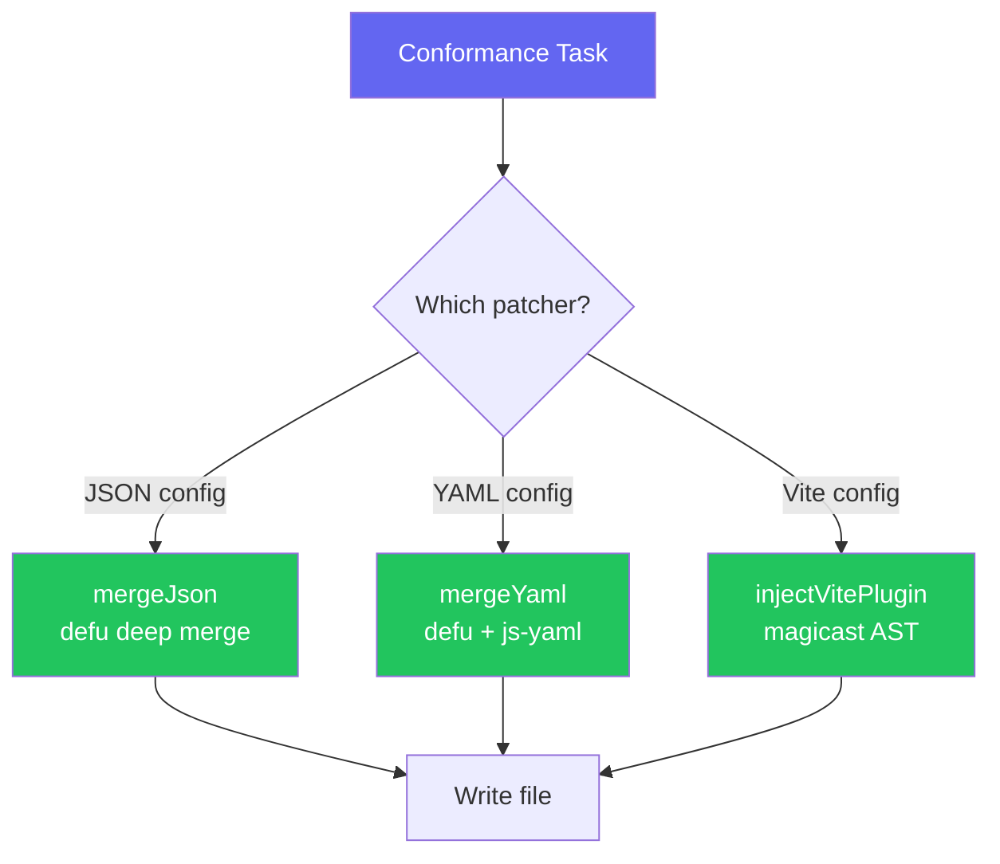

import { Aside, Steps } from '@astrojs/starlight/components'

The `@xtarterize/patchers` package provides utilities for safely modifying configuration files without overwriting existing customizations.

## Available Patchers

| Patcher | Description |
|---------|-------------|
| `mergeJson` | Deep merge JSON objects using [`defu`](https://github.com/unjs/defu) — existing keys take precedence |
| `mergeYaml` | Deep merge YAML objects using [`defu`](https://github.com/unjs/defu) and [`js-yaml`](https://github.com/nodeca/js-yaml) |
| `injectVitePlugin` | AST-based plugin injection into `vite.config.ts` using [`magicast`](https://github.com/unjs/magicast) |

## Architecture



## JSON Merge

```typescript
import { mergeJson } from '@xtarterize/patchers'

const existing = { compilerOptions: { strict: true, target: "ES2022" } }
const incoming = { compilerOptions: { incremental: true, strict: true } }

const merged = mergeJson(existing, incoming)
// { compilerOptions: { strict: true, target: "ES2022", incremental: true } }
```

<Aside type="tip">
  The [`defu`](https://github.com/unjs/defu) library ensures that existing user configuration is never overwritten — incoming values only fill gaps. Learn more in the [JSON Merge](/contributing/patchers/json-merge/) reference.
</Aside>

## YAML Merge

```typescript
import { mergeYaml } from '@xtarterize/patchers'

const existing = `
name: CI
on:
  push:
    branches: [main]
`

const incoming = `
name: CI
on:
  pull_request:
    branches: [main]
`

const merged = mergeYaml(existing, incoming)
// Both push and pull_request triggers preserved
```

## AST Patching (Vite Plugins)

```typescript
import { injectVitePlugin } from '@xtarterize/patchers'

const result = await injectVitePlugin(
  '/path/to/vite.config.ts',
  'vite-plugin-checker',    // import path
  'checker',                // import name
  'checker({ typescript: true })'  // plugin expression
)

if (!result.success) {
  console.log(result.fallback) // Manual instructions if AST structure is unsupported
}
```

<Steps>

1. **Parse** — Parses `vite.config.ts` using `magicast`
2. **Check** — Checks if the plugin is already imported (idempotent)
3. **Insert import** — Inserts the import at the top of the file
4. **Append plugin** — Appends the plugin call to the `plugins` array
5. **Write** — Writes the file back

</Steps>

<Aside type="note">
  If the config structure is non-standard (factory functions, conditional exports), the AST patcher falls back to returning manual instructions rather than corrupting the file.
</Aside>

## References

- [defu](https://github.com/unjs/defu) — Deep merge utility for JavaScript objects
- [js-yaml](https://github.com/nodeca/js-yaml) — YAML parser and serializer for JavaScript
- [magicast](https://github.com/unjs/magicast) — AST manipulation library for JavaScript/TypeScript
- [Vite Plugin API](https://vitejs.dev/guide/api-plugin.html) — How Vite plugins work
