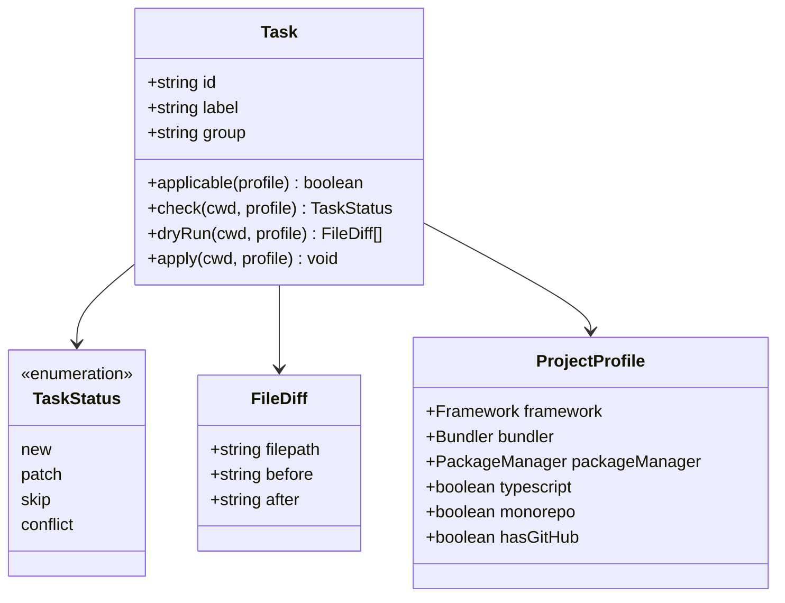

import { Aside, FileTree, LinkButton } from '@astrojs/starlight/components'

xtarterize applies conformance configuration through discrete, independently applicable tasks. This page covers the architecture and how to contribute new tasks.

## Task Interface

All tasks implement the `Task` interface from `@xtarterize/core`:

```typescript
interface Task {
  id: string
  label: string
  group: string
  applicable: (profile: ProjectProfile) => boolean
  check: (cwd: string, profile: ProjectProfile) => Promise<TaskStatus>
  dryRun: (cwd: string, profile: ProjectProfile) => Promise<FileDiff[]>
  apply: (cwd: string, profile: ProjectProfile) => Promise<void>
}
```

## Task Architecture



## Task Directory Structure

<FileTree>
- packages/tasks/src/
  - agent/
    - agents-md.ts
    - skills.ts
  - ci/
    - auto-update.ts
    - ci.ts
    - release.ts
  - codegen/
    - plop.ts
  - deps/
    - renovate.ts
  - editor/
    - vscode.ts
  - factory.ts
  - lint/
    - biome.ts
  - monorepo/
    - turbo.ts
  - quality/
    - knip.ts
  - release/
    - cat-version.ts
    - commitlint.ts
    - czg.ts
  - scripts/
    - package-scripts.ts
  - ts/
    - strict.ts
    - paths.ts
    - incremental.ts
    - gitignore-tsbuildinfo.ts
  - vite/
    - checker.ts
    - visualizer.ts
</FileTree>

## Task Factory

Most tasks are created through factory functions in `factory.ts` that eliminate boilerplate:

- **`createSimpleFileTask`** — For tasks that write a single new file (CI workflows, renovate, commitlint, knip, plop, AI skills)
- **`createFileTask`** — For text files with custom check/merge logic (AGENTS.md, .gitignore entries)
- **`createJsonMergeTask`** — For tasks that deep-merge JSON configs (tsconfig, biome, turbo). Uses `deepEqual` for key-order-independent comparison
- **`createMultiFileJsonMergeTask`** — For tasks that merge multiple JSON files (VSCode settings + extensions). Supports custom per-file merge functions
- **`createVitePluginTask`** — For injecting plugins into vite.config.ts (checker, visualizer)
- **`createPackageJsonTask`** — For tasks that add scripts, deps, and extra files via package.json (czg, commit-and-tag-version, package scripts)

This reduces most tasks from 40-80 lines to 10-15 lines of declarative configuration.

### deepEqual Helper

The `deepEqual` function compares objects regardless of key ordering, preventing false positives when `JSON.stringify` would differ due to object key order. Used by `createJsonMergeTask` and `createMultiFileJsonMergeTask` for reliable skip detection.

## Adding New Tasks

1. Implement the `Task` interface from `@xtarterize/core`
2. Create your task file in `packages/tasks/src/<category>/<task>.ts`
3. Export it from `packages/tasks/src/index.ts`
4. Add tests in `test/tasks/`

Each task must implement:
- `applicable(profile)` — Should this task run for this project?
- `check(cwd, profile)` — What's the current status?
- `dryRun(cwd, profile)` — What would change?
- `apply(cwd, profile)` — Make the changes

## Conflict Detection Pattern

For tasks that patch JSON config files, use a **tristate detection pattern** to avoid permanent patch loops:

| State | Condition | Status | Behavior |
|-------|-----------|--------|----------|
| **Missing** | Key does not exist | `patch` | Add the key |
| **Match** | Key exists with expected value | `skip` | No changes |
| **Mismatch** | Key exists with different value | `conflict` | Alert user, don't overwrite |

This prevents infinite loops when a user explicitly sets a value that differs from xtarterize's recommendation (e.g., `strict: false` in tsconfig).

<LinkButton href="/contributing/architecture/overview/">Learn about the overall architecture →</LinkButton>
