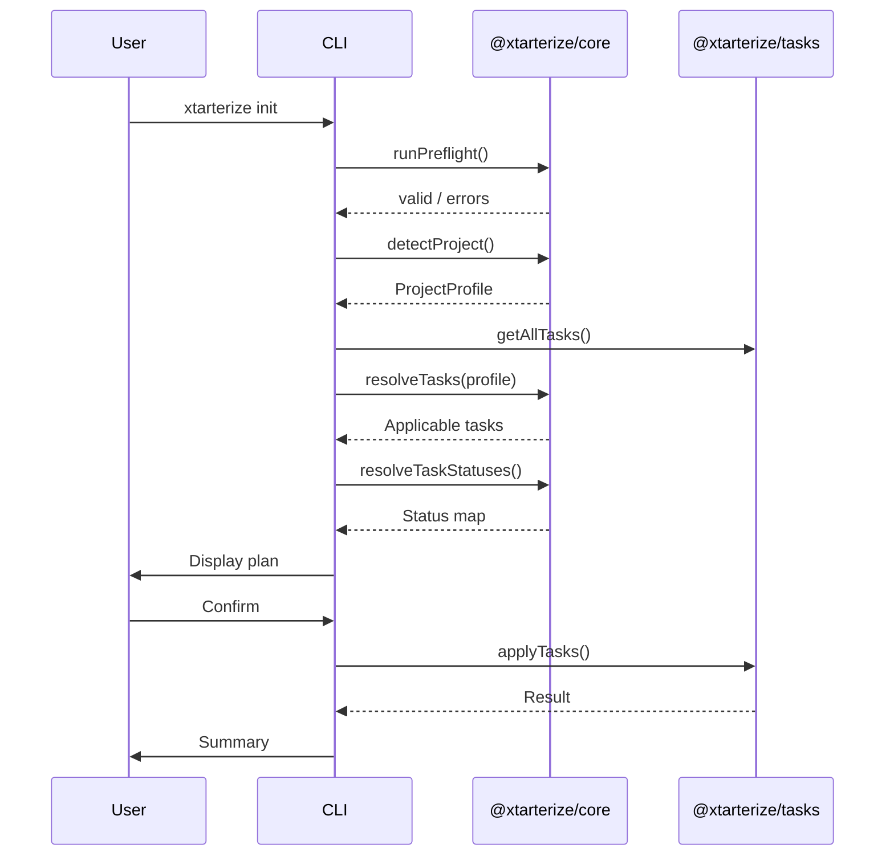

import { Aside, Steps, Tabs, TabItem } from '@astrojs/starlight/components'

## Initialize a Project

To apply conformance configuration to a project:

```bash
npx xtarterize init
```

<Steps>

1. **Scan** your project directory to detect framework, bundler, package manager, monorepo status, and existing configs
2. **Resolve** which conformance tasks are applicable for your stack
3. **Check** each task's current status (`new`, `patch`, `skip`, or `conflict`)
4. **Display** a conformance plan table showing what will change
5. **Prompt** you to apply all, select specific tasks, dry-run, or quit

</Steps>

## Example Output

```
✦ Scanning project...

  Detected:
    Framework:   React 18
    Bundler:     Vite 5
    Package Manager: pnpm

  Conformance plan:

    ✔ Biome (lint + format)              lint/biome           [new]
    ✔ vite-plugin-checker                vite/checker         [new]
    ~ tsconfig — incremental: true       ts/incremental       [patch]
    = Turbo                              monorepo/turbo       [skip — no monorepo]

  [A] Apply all   [S] Select items   [D] Dry-run   [Q] Quit
```

## Options

| Flag | Description |
|------|-------------|
| `--dry-run` | Preview all changes without applying anything |
| `--yes` | Skip all confirmations, apply all changes automatically |
| `--skip <task-id>` | Exclude a specific task (comma-separated) |
| `--only <task-id>` | Apply only a specific task (comma-separated) |
| `--quiet` | Suppress interactive prompts and verbose output |

## Examples

<Tabs>
  <TabItem label="Preview">
    ```bash
    npx xtarterize init --dry-run
    ```
  </TabItem>
  <TabItem label="Apply all">
    ```bash
    npx xtarterize init --yes
    ```
  </TabItem>
  <TabItem label="Skip tasks">
    ```bash
    npx xtarterize init --skip codegen/plop
    ```
  </TabItem>
  <TabItem label="Only specific">
    ```bash
    npx xtarterize init --only lint/biome
    ```
  </TabItem>
</Tabs>

## What Gets Applied

The `init` command applies all tasks that are applicable to your detected stack:

- **Linting & Formatting** — [Biome](https://biomejs.dev/) (lint + format), with [Tailwind CSS](https://tailwindcss.com/) parser support when detected
- **TypeScript** — [strict mode](https://www.typescriptlang.org/tsconfig/#strict), [path aliases](https://www.typescriptlang.org/tsconfig/#paths), [incremental builds](https://www.typescriptlang.org/tsconfig/#incremental), `.gitignore` tsbuildinfo entries
- **Vite Plugins** — [vite-plugin-checker](https://vite-plugin-checker.netlify.app/), [rollup-plugin-visualizer](https://github.com/btd/rollup-plugin-visualizer)
- **CI/CD** — [GitHub Actions](https://docs.github.com/en/actions) workflows for release, CI, auto-updates (with [`pnpm/action-setup`](https://github.com/pnpm/action-setup) for pnpm projects)
- **Dependencies** — [Renovate](https://docs.renovatebot.com/) config
- **Release** — [Commitlint](https://commitlint.js.org/), [czg](https://cz-git.qbb.sh/cli/), [commit-and-tag-version](https://github.com/absolute-version/commit-and-tag-version)
- **Quality** — [Knip](https://knip.dev/) (unused code detection)
- **Codegen** — [Plop](https://plopjs.com/) (code generation scaffolds)
- **Monorepo** — [Turborepo](https://turbo.build/) (when monorepo detected)
- **Editor** — [VS Code](https://code.visualstudio.com/) settings and extensions (additive merging preserves your existing extensions)
- **Agent** — `AGENTS.md`, AI skills directory
- **Scripts** — `package.json` scripts (with [Ultracite](https://www.ultracite.ai/) detection if installed)

<Aside>
  Each task checks if it's already applied and skips if conformant. Running `init` twice produces no changes on the second run.
</Aside>

## Ultracite

xtarterize sets up [Biome](https://biomejs.dev/) with sensible defaults. If you want stricter, more opinionated linting, we recommend [Ultracite](https://www.ultracite.ai/) — a Biome preset with stricter rules for code quality.

After running `xtarterize init`, you can optionally run:

```bash
npx ultracite init
```

This will replace the default `biome.json` with Ultracite's stricter configuration. The `package.json` lint scripts will automatically detect Ultracite and use `ultracite` instead of `biome check`.

## References

- [Biome Configuration](https://biomejs.dev/reference/configuration/) — Full `biome.json` reference
- [TypeScript tsconfig Reference](https://www.typescriptlang.org/tsconfig/) — All compiler options explained
- [Vite Plugin Checker](https://vite-plugin-checker.netlify.app/) — Type-checking during development
- [GitHub Actions Documentation](https://docs.github.com/en/actions) — Workflow syntax and features
- [Renovate Configuration Options](https://docs.renovatebot.com/configuration-options/) — Dependency automation reference
- [Commitlint Rules](https://commitlint.js.org/reference/rules.html) — Conventional commit validation
- [Knip Documentation](https://knip.dev/) — Finding unused files, dependencies, and exports
- [Plop Documentation](https://plopjs.com/documentation/) — Code scaffolding and generators
- [Turborepo Documentation](https://turbo.build/repo/docs) — Monorepo task orchestration
- [Ultracite](https://www.ultracite.ai/) — Strict Biome preset for code quality

## Init Flow


