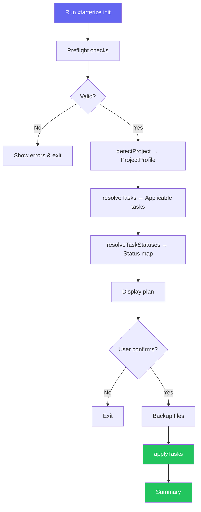

import { Steps, LinkButton } from '@astrojs/starlight/components'

xtarterize is an adaptive CLI tool that automates the setup, enforcement, and ongoing synchronization of developer conformance configurations across [JavaScript](https://developer.mozilla.org/en-US/docs/Web/JavaScript)/[TypeScript](https://www.typescriptlang.org/) projects.

## Why xtarterize?

Modern JS/TS projects require a large and growing set of tooling configuration: [linters](https://biomejs.dev/), [formatters](https://biomejs.dev/), [bundler plugins](https://vitejs.dev/guide/using-plugins.html), [TypeScript settings](https://www.typescriptlang.org/tsconfig/), [CI/CD workflows](https://docs.github.com/en/actions), [release automation](https://github.com/absolute-version/commit-and-tag-version), [code generation scaffolds](https://plopjs.com/), [dependency management](https://docs.renovatebot.com/), and [editor settings](https://code.visualstudio.com/docs/getstarted/settings). Setting these up consistently across projects is:

- **Repetitive** — the same configs are rewritten or copy-pasted project to project
- **Error-prone** — manual patching of `package.json`, `tsconfig.json`, or `vite.config.ts` often misses edge cases
- **Inconsistent** — configs diverge between projects over time as standards evolve
- **Context-blind** — a React project needs different config than a React Native or Vue project

xtarterize solves this by being detection-first, context-aware, non-destructive, idempotent, and evolvable.

## How It Works

<Steps>

1. **Detect** — Scans your project to build a full `ProjectProfile` (framework, bundler, styling, package manager, monorepo status, existing configs)
2. **Resolve** — Maps the profile to applicable conformance tasks (e.g., [Vite](https://vitejs.dev/) tasks only for Vite projects)
3. **Check** — Determines each task's status: `new` (file doesn't exist), `patch` (needs merging), `skip` (already conformant), or `conflict` (incompatible)
4. **Plan** — Displays a conformance plan table for review
5. **Apply** — Backs up files, then applies changes using [deep merge](https://github.com/unjs/defu) or [AST manipulation](https://github.com/unjs/magicast)

</Steps>



## Getting Help

If you have questions or need help:

- Check the [CLI Reference](/guide/cli/overview/) for all commands and flags
- Review the [Tasks Guide](/guide/tasks/overview/) to see what conformance tasks are available
- Look at the [Contributing](/contributing/architecture/overview/) section if you want to contribute to the project

## Starting a New Project?

If you're bootstrapping a fresh project, consider using [**create-xtarter-app**](https://github.com/agustinusnathaniel/create-xtarter-app) first. It scaffolds curated starter templates (Next.js/Vite + Chakra/Tailwind/Hero UI) in seconds, then you can run `xtarterize init` to layer on additional conformance configs.

```bash
# Step 1: Scaffold a new project from a template
npx create-xtarter-app@latest my-app

# Step 2: Apply additional production-grade configs
cd my-app
npx xtarterize init
```

## References

- [TypeScript Documentation](https://www.typescriptlang.org/docs/) — Learn about TypeScript compiler options and configuration
- [Biome](https://biomejs.dev/) — Fast linter and formatter for JavaScript/TypeScript
- [Vite](https://vitejs.dev/) — Next-generation frontend build tool
- [GitHub Actions](https://docs.github.com/en/actions) — CI/CD automation platform
- [commit-and-tag-version](https://github.com/absolute-version/commit-and-tag-version) — Automated versioning and changelog generation
- [Plop](https://plopjs.com/) — Micro-generator framework for code scaffolding
- [Renovate](https://docs.renovatebot.com/) — Automated dependency updates
- [VS Code Settings](https://code.visualstudio.com/docs/getstarted/settings) — Editor configuration documentation

<LinkButton href="/getting-started/installation/">Install xtarterize →</LinkButton>
