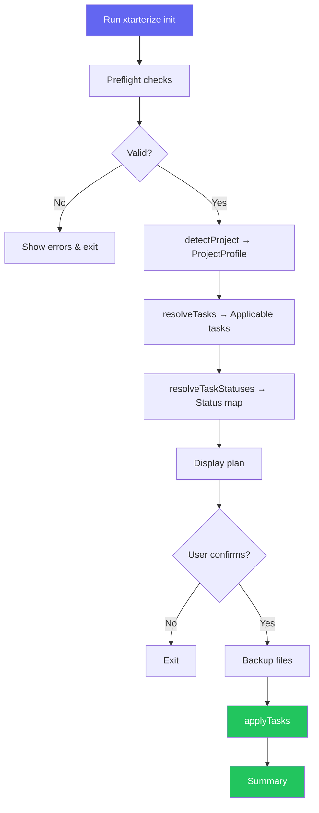

import { Steps, LinkButton } from '@astrojs/starlight/components'

# Introduction

Xtarterize is an adaptive CLI tool that automates the setup, enforcement, and ongoing synchronization of developer conformance configurations across JavaScript/TypeScript projects.

## Why Xtarterize?

Modern JS/TS projects require a large and growing set of tooling configuration: linters, formatters, bundler plugins, TypeScript settings, CI/CD workflows, release automation, code generation scaffolds, dependency management, and editor settings. Setting these up consistently across projects is:

- **Repetitive** — the same configs are rewritten or copy-pasted project to project
- **Error-prone** — manual patching of `package.json`, `tsconfig.json`, or `vite.config.ts` often misses edge cases
- **Inconsistent** — configs diverge between projects over time as standards evolve
- **Context-blind** — a React project needs different config than a React Native or Vue project

Xtarterize solves this by being detection-first, context-aware, non-destructive, idempotent, and evolvable.

## How It Works

<Steps>

1. **Detect** — Scans your project to build a full `ProjectProfile` (framework, bundler, styling, package manager, monorepo status, existing configs)
2. **Resolve** — Maps the profile to applicable conformance tasks (e.g., vite tasks only for Vite projects)
3. **Check** — Determines each task's status: `new` (file doesn't exist), `patch` (needs merging), `skip` (already conformant), or `conflict` (incompatible)
4. **Plan** — Displays a conformance plan table for review
5. **Apply** — Backs up files, then applies changes using deep merge or AST manipulation

</Steps>

## Getting Help

If you have questions or need help:

- Check the [CLI Reference](/guide/cli/overview/) for all commands and flags
- Review the [Tasks Guide](/guide/tasks/overview/) to see what conformance tasks are available
- Look at the [Contributing](/contributing/architecture/overview/) section if you want to contribute to the project

<LinkButton href="/getting-started/installation/">Install Xtarterize →</LinkButton>
