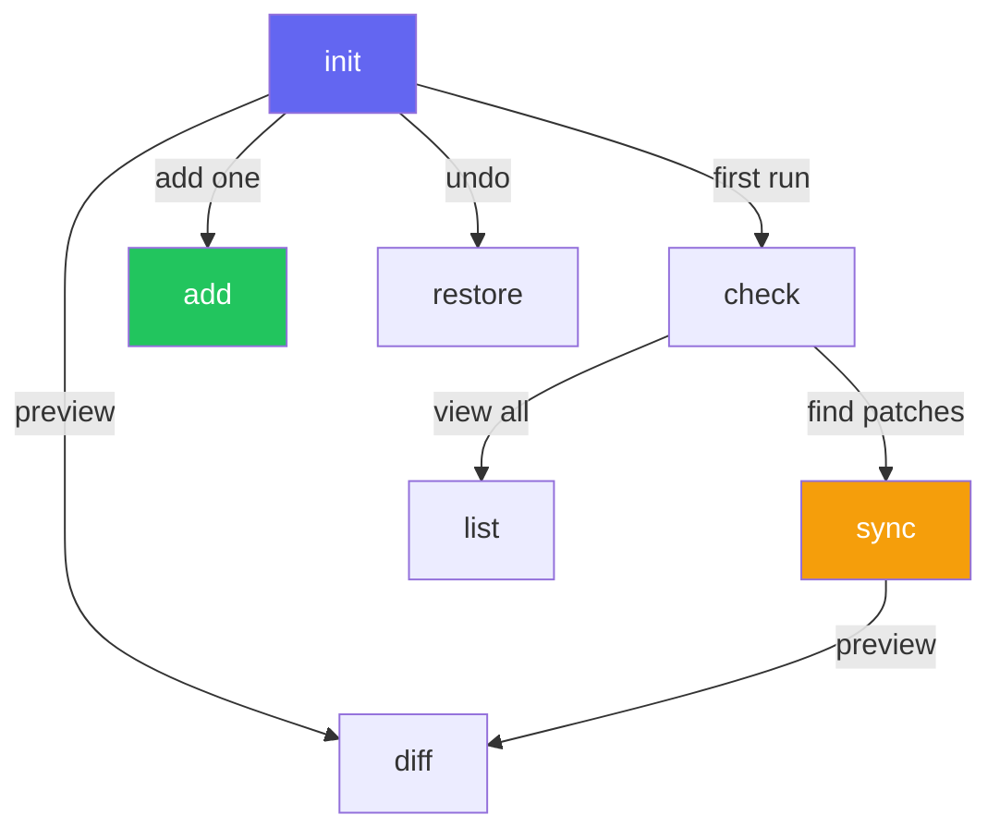

import { Aside, Tabs, TabItem, LinkButton } from '@astrojs/starlight/components'

The xtarterize CLI provides commands to detect, apply, and maintain conformance configuration for JavaScript/TypeScript projects.

## Available Commands

| Command | Description |
|---------|-------------|
| [`xtarterize init`](#init) | Full conformance setup — detect, plan, apply |
| [`xtarterize sync`](#sync) | Update existing configs to latest templates |
| [`xtarterize diff`](#diff) | Show pending changes without applying |
| [`xtarterize check`](#check) | Audit current conformance status |
| [`xtarterize add <task-id>`](#add) | Apply a single conformance task |
| [`xtarterize restore <file>`](#restore) | Restore a file from backup |
| [`xtarterize list`](#list) | List all available tasks with status |

## `init`

Full conformance setup. Detects your project stack, shows a plan, and applies changes.

<Tabs>
  <TabItem label="Basic">
    ```bash
    npx xtarterize init
    ```
  </TabItem>
  <TabItem label="Dry run">
    ```bash
    npx xtarterize init --dry-run
    ```
  </TabItem>
  <TabItem label="Auto-apply">
    ```bash
    npx xtarterize init --yes
    ```
  </TabItem>
  <TabItem label="Skip tasks">
    ```bash
    npx xtarterize init --skip lint/oxlint
    ```
  </TabItem>
  <TabItem label="Only specific">
    ```bash
    npx xtarterize init --only lint/biome,ts/incremental
    ```
  </TabItem>
</Tabs>

## `sync`

Update existing project configs to match the latest conformance templates. Only shows tasks with `patch` or `conflict` status.

```bash
npx xtarterize sync
npx xtarterize sync --dry-run
npx xtarterize sync --yes
```

<Aside type="note">
  Unlike `init`, `sync` only targets tasks with `patch` or `conflict` status. It won't re-apply already conformant configs.
</Aside>

## `diff`

Show what `sync` would change, without applying anything. Read-only.

```bash
npx xtarterize diff
```

## `check`

Audit which tasks are conformant and which need attention.

```bash
npx xtarterize check
```

Output shows:

| Icon | Status | Meaning |
|------|--------|---------|
| ✔ | `skip` | Conformant — no action needed |
| ~ | `patch` | Needs update — will be patched |
| ✗ | `new` | Missing entirely — will be created |
| ⚠ | `conflict` | Incompatible config — needs manual resolution |

## `add`

Apply a single conformance task.

```bash
npx xtarterize add lint/biome
npx xtarterize add ci/release
npx xtarterize add codegen/plop
```

## `restore`

Restore a file from a previous backup.

```bash
npx xtarterize restore tsconfig.json
npx xtarterize restore biome.json
```

## `list`

List all registered tasks grouped by category, with current status.

```bash
npx xtarterize list
```

## Task Status Values

Each task reports one of four statuses:

| Status | Meaning |
|--------|---------|
| `new` | File/config doesn't exist yet |
| `patch` | File exists but needs additions/updates |
| `skip` | Already conformant, nothing to do |
| `conflict` | Existing config is incompatible; requires decision |

## Backup System

Before any file is modified, xtarterize creates a timestamped backup in `.xtarterize/backups/`. You can restore any file using the `restore` command.

<Aside type="tip">
  Backups are stored with timestamps in `.xtarterize/backups/` and indexed in `.xtarterize/backups/.index.json`. Use `xtarterize restore <file>` to revert any change.
</Aside>

## Command Relationships



<LinkButton href="/guide/tasks/overview/">Explore conformance tasks →</LinkButton>
