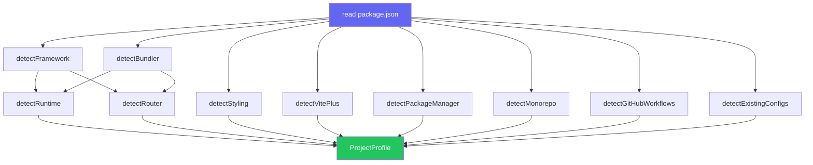
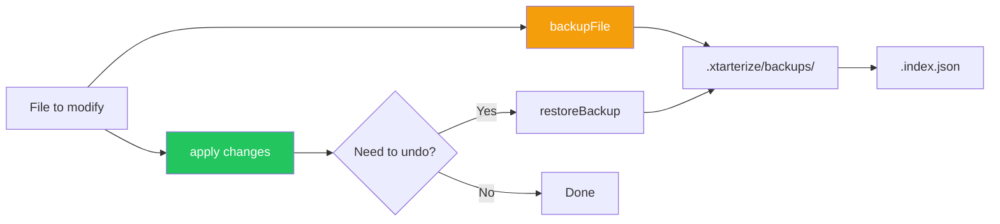

import { Aside, FileTree, Tabs, TabItem } from '@astrojs/starlight/components'

xtarterize doesn't require a config file. It detects your project's stack automatically and applies only what's appropriate.

## Detection

When you run `init`, xtarterize scans your project to build a `ProjectProfile`:

- **Framework** — [React](https://react.dev/), [Vue](https://vuejs.org/), [Svelte](https://svelte.dev/), [Solid](https://www.solidjs.com/), [React Native](https://reactnative.dev/), or [Node](https://nodejs.org/) (from `package.json` deps)
- **Bundler** — [Vite](https://vitejs.dev/), [Next.js](https://nextjs.org/), [TanStack Start](https://tanstack.com/start/latest), [Expo](https://expo.dev/), [Webpack](https://webpack.js.org/), or none
- **Router** — [TanStack Router](https://tanstack.com/router/latest), [React Router](https://reactrouter.com/), [Vue Router](https://router.vuejs.org/), [Expo Router](https://docs.expo.dev/router/introduction/), or none
- **Styling** — [Tailwind CSS](https://tailwindcss.com/), [CSS Modules](https://github.com/css-modules/css-modules), [Styled Components](https://styled-components.com/), [Vanilla Extract](https://vanilla-extract.style/), [NativeWind](https://www.nativewind.dev/), or Vanilla
- **Package Manager** — [pnpm](https://pnpm.io/), [npm](https://www.npmjs.com/), [yarn](https://yarnpkg.com/), or [bun](https://bun.sh/) (from lockfiles or `packageManager` field)
- **Monorepo** — Detected via [`pnpm-workspace.yaml`](https://pnpm.io/pnpm-workspace_yaml), [`turbo.json`](https://turbo.build/repo/docs/reference/configuration), `packages/` + `apps/` dirs
- **GitHub** — [`.github/`](https://docs.github.com/en/actions/using-workflows/about-workflows) directory presence
- **Existing Configs** — Checks for [`biome.json`](https://biomejs.dev/reference/configuration/), [`tsconfig.json`](https://www.typescriptlang.org/tsconfig/), [`renovate.json`](https://docs.renovatebot.com/configuration-options/), [`vite.config.*`](https://vitejs.dev/config/), [`.versionrc`](https://github.com/absolute-version/commit-and-tag-version#configuration), [`.gitignore`](https://git-scm.com/docs/gitignore), etc.

## Detection Flow



## Detection Sources

<Tabs>
  <TabItem label="package.json">
    Framework, bundler, router, styling, and TypeScript are all detected from [`dependencies`](https://docs.npmjs.com/cli/v10/configuring-npm/package-json#dependencies) and [`devDependencies`](https://docs.npmjs.com/cli/v10/configuring-npm/package-json#devdependencies).
  </TabItem>
  <TabItem label="Lock files">
    Package manager is detected from lock file presence: [`pnpm-lock.yaml`](https://pnpm.io/), [`yarn.lock`](https://yarnpkg.com/features/zero-installs), [`package-lock.json`](https://docs.npmjs.com/cli/v10/configuring-npm/package-lock-json), or [`bun.lock`](https://bun.sh/docs/install/lockfile).
  </TabItem>
  <TabItem label="File system">
    Monorepo status, GitHub, and existing configs are detected by checking for specific files and directories.
  </TabItem>
</Tabs>

## Ambiguity Resolution

<Aside type="note">
  If both `react` and `react-native` are detected, xtarterize prompts you to clarify which describes the project. In CI mode (`--quiet`), it defaults to `react`.
</Aside>

## Task Gating

Tasks are gated on the detected profile:

- Vite plugin tasks only run when `bundler === 'vite'`
- Monorepo tasks only run when `monorepo === true`
- CI tasks only run when `hasGitHub === true`
- TypeScript tasks only run when `typescript === true`

## Parameterized Templates

All templates adapt to the detected profile:

- GitHub workflows use the detected package manager for install commands
- Knip entry points are inferred from the bundler/framework
- Plop generators vary by framework (React gets component+hook, Vue gets component+composable, etc.)
- VS Code extensions include framework-specific recommendations
- AGENTS.md includes framework-specific instructions

## Backup System

Before any file is modified, xtarterize creates a timestamped backup in `.xtarterize/backups/`. An index file tracks all backups for easy restoration.

<FileTree>
- .xtarterize/
  - backups/
    - .index.json
    - tsconfig.json.2024-01-15T10-30-00-000Z
    - biome.json.2024-01-15T10-30-00-000Z
</FileTree>

Restore with:

```bash
npx xtarterize restore tsconfig.json
```

## References

- [React](https://react.dev/) — UI library
- [Vue.js](https://vuejs.org/) — Progressive JavaScript framework
- [Svelte](https://svelte.dev/) — Cybernetically enhanced web apps
- [Solid](https://www.solidjs.com/) — Simple and performant reactivity
- [React Native](https://reactnative.dev/) — Native apps with React
- [Vite](https://vitejs.dev/) — Next-generation frontend tooling
- [Next.js](https://nextjs.org/) — React framework for production
- [TanStack Start](https://tanstack.com/start/latest) — Full-stack React framework
- [Expo](https://expo.dev/) — React Native framework
- [Webpack](https://webpack.js.org/) — Module bundler
- [Tailwind CSS](https://tailwindcss.com/) — Utility-first CSS framework
- [pnpm Workspaces](https://pnpm.io/workspaces) — Monorepo support
- [Turborepo](https://turbo.build/repo/docs) — Monorepo task runner
- [Bun](https://bun.sh/) — Fast JavaScript runtime and package manager

## Backup Architecture


