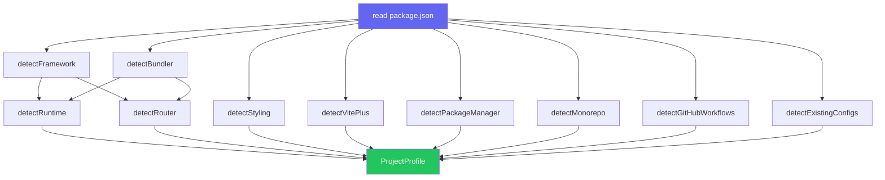
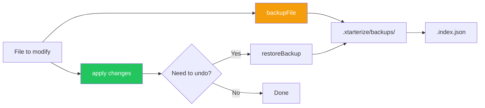

import { Aside, FileTree, Tabs, TabItem } from '@astrojs/starlight/components'

# Configuration

Xtarterize doesn't require a config file. It detects your project's stack automatically and applies only what's appropriate.

## Detection

When you run `init`, Xtarterize scans your project to build a `ProjectProfile`:

- **Framework** — React, Vue, Svelte, Solid, React Native, or Node (from `package.json` deps)
- **Bundler** — Vite, Next.js, TanStack Start, Expo, Webpack, or none
- **Router** — TanStack Router, React Router, Vue Router, Expo Router, or none
- **Styling** — Tailwind, CSS Modules, Styled Components, Vanilla Extract, NativeWind, or Vanilla
- **Package Manager** — pnpm, npm, yarn, or bun (from lockfiles or `packageManager` field)
- **Monorepo** — Detected via `pnpm-workspace.yaml`, `turbo.json`, `packages/` + `apps/` dirs
- **GitHub** — `.github/` directory presence
- **Existing Configs** — Checks for `biome.json`, `tsconfig.json`, `renovate.json`, etc.

## Detection Flow



## Detection Sources

<Tabs>
  <TabItem label="package.json">
    Framework, bundler, router, styling, and TypeScript are all detected from `dependencies` and `devDependencies`.
  </TabItem>
  <TabItem label="Lock files">
    Package manager is detected from lock file presence: `pnpm-lock.yaml`, `yarn.lock`, `package-lock.json`, or `bun.lock`.
  </TabItem>
  <TabItem label="File system">
    Monorepo status, GitHub, and existing configs are detected by checking for specific files and directories.
  </TabItem>
</Tabs>

## Ambiguity Resolution

<Aside type="note">
  If both `react` and `react-native` are detected, Xtarterize prompts you to clarify which describes the project. In CI mode (`--quiet`), it defaults to `react`.
</Aside>

## Task Gating

Tasks are gated on the detected profile:

- Vite plugin tasks only run when `bundler === 'vite'`
- Monorepo tasks only run when `monorepo === true`
- CI tasks only run when `hasGitHub === true`
- TypeScript tasks only run when `typescript === true`

## Parameterized Templates

All templates adapt to the detected profile:

- GitHub workflows use the detected package manager for install commands
- Knip entry points are inferred from the bundler/framework
- Plop generators vary by framework (React gets component+hook, Vue gets component+composable, etc.)
- VS Code extensions include framework-specific recommendations
- AGENTS.md includes framework-specific instructions

## Backup System

Before any file is modified, Xtarterize creates a backup in `.xtarterize/backups/`. An index file tracks all backups.

<FileTree>
- .xtarterize/
  - backups/
    - .index.json
    - tsconfig.json.2024-01-15T10-30-00-000Z
    - biome.json.2024-01-15T10-30-00-000Z
</FileTree>

Restore with:

```bash
npx xtarterize restore tsconfig.json
```

## Backup Architecture


