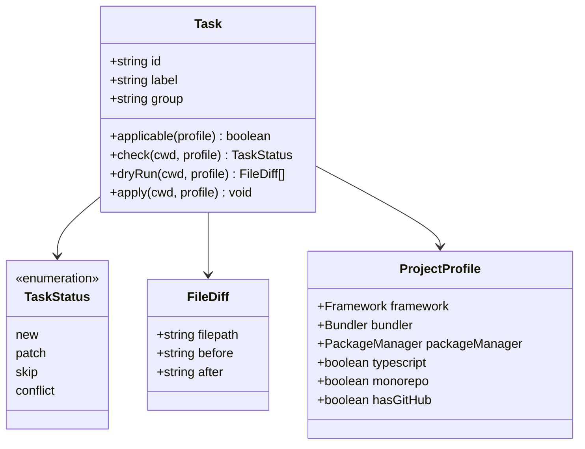

import { Aside, FileTree, LinkButton } from '@astrojs/starlight/components'

# Conformance Tasks

Xtarterize applies conformance configuration through discrete, independently applicable tasks. Each task detects whether it's needed and only applies changes if necessary.

## Task Architecture



## Task Directory Structure

<FileTree>
- packages/tasks/src/
  - agent/
    - agents-md.ts
    - skills.ts
  - ci/
    - auto-update.ts
    - ci.ts
    - release.ts
  - codegen/
    - plop.ts
  - deps/
    - renovate.ts
  - editor/
    - vscode.ts
  - factory.ts
  - lint/
    - biome.ts
    - ultracite.ts
  - monorepo/
    - turbo.ts
  - quality/
    - knip.ts
  - release/
    - cat-version.ts
    - commitlint.ts
    - czg.ts
  - scripts/
    - package-scripts.ts
  - ts/
    - incremental.ts
  - vite/
    - checker.ts
    - visualizer.ts
</FileTree>

## Task Factory

Most tasks are created through factory functions in `factory.ts` that eliminate boilerplate:

- **`createSimpleFileTask`** — For tasks that write a single file (CI workflows, renovate, commitlint, knip, plop, agents-md)
- **`createJsonMergeTask`** — For tasks that deep-merge JSON configs (tsconfig, vscode settings, biome, turbo)
- **`createFileTask`** — For tasks with custom check logic (ultracite, vite plugins)

This reduces most tasks from 40-80 lines to 10-15 lines of declarative configuration.

## Linting & Formatting

| Task ID | Description | Applicable When |
|---------|-------------|-----------------|
| `lint/biome` | Install Biome, write `biome.json` | Always (TS/JS projects) |
| `lint/ultracite` | Apply Ultracite's opinionated Biome config layer | When Biome is configured |

## TypeScript

| Task ID | Description | Applicable When |
|---------|-------------|-----------------|
| `ts/incremental` | Patch `tsconfig.json` with `incremental: true` and `tsBuildInfoFile` | TypeScript detected |

## Vite Plugins

| Task ID | Description | Applicable When |
|---------|-------------|-----------------|
| `vite/checker` | Inject `vite-plugin-checker` into `vite.config.ts` via AST | Bundler is Vite |
| `vite/visualizer` | Inject `rollup-plugin-visualizer` into `vite.config.ts` via AST | Bundler is Vite |

## CI/CD

| Task ID | Description | Applicable When |
|---------|-------------|-----------------|
| `ci/release` | Write `.github/workflows/release.yml` — triggers on tag push | GitHub detected |
| `ci/auto-update` | Write `.github/workflows/auto-update.yml` — weekly dependency updates | GitHub detected |
| `ci/ci` | Write `.github/workflows/ci.yml` — lint, typecheck, test on PR | GitHub detected |

## Dependencies

| Task ID | Description | Applicable When |
|---------|-------------|-----------------|
| `deps/renovate` | Write `renovate.json` with opinionated automerge config | Always |

## Release

| Task ID | Description | Applicable When |
|---------|-------------|-----------------|
| `release/commitlint` | Install commitlint, write `commitlint.config.ts` | Git detected |
| `release/czg` | Install czg, add `commit` script to `package.json` | Always |
| `release/cat-version` | Install `commit-and-tag-version`, write `.versionrc` | Always |

## Code Quality

| Task ID | Description | Applicable When |
|---------|-------------|-----------------|
| `quality/knip` | Install knip, write `knip.json` with framework-aware entry points | TypeScript detected |

## Code Generation

| Task ID | Description | Applicable When |
|---------|-------------|-----------------|
| `codegen/plop` | Install plop, write `plopfile.ts` with framework-specific generators | Always |

## Monorepo

| Task ID | Description | Applicable When |
|---------|-------------|-----------------|
| `monorepo/turbo` | Install turbo, write `turbo.json` with build/lint/test pipeline | Monorepo detected |

## Editor

| Task ID | Description | Applicable When |
|---------|-------------|-----------------|
| `editor/vscode` | Write/merge `.vscode/settings.json` and `.vscode/extensions.json` | Always |

## Agent

| Task ID | Description | Applicable When |
|---------|-------------|-----------------|
| `agent/agents-md` | Write `AGENTS.md` with framework-specific AI agent instructions | Always |
| `agent/skills` | Scaffold `.agents/skills/` directory with project context | TypeScript detected |

## Scripts

| Task ID | Description | Applicable When |
|---------|-------------|-----------------|
| `scripts/package-scripts` | Patch `package.json` scripts with lint, format, typecheck, etc. | Always |

## Idempotency

<Aside type="tip">
  Every task is idempotent. Running `init` twice produces no changes on the second run.
</Aside>

Each task implements:

- **`check()`** — Returns `new`, `patch`, `skip`, or `conflict` based on current state
- **`dryRun()`** — Returns exact diffs without writing anything
- **`apply()`** — Writes changes, backing up files first

## Adding New Tasks

Tasks implement the `Task` interface from `@xtarterize/core`:

```typescript
interface Task {
  id: string
  label: string
  group: string
  applicable: (profile: ProjectProfile) => boolean
  check: (cwd: string, profile: ProjectProfile) => Promise<TaskStatus>
  dryRun: (cwd: string, profile: ProjectProfile) => Promise<FileDiff[]>
  apply: (cwd: string, profile: ProjectProfile) => Promise<void>
}
```

To add a new task, create a file in `packages/tasks/src/` and register it in `packages/tasks/src/index.ts`.

<LinkButton href="/contributing/architecture/overview/">Learn about the architecture →</LinkButton>
