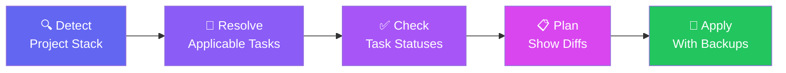

import { LinkCard, CardGrid, LinkButton } from '@astrojs/starlight/components'

<div class="terminal-demo">
<div class="terminal-header">
<span class="terminal-dot red"></span>
<span class="terminal-dot yellow"></span>
<span class="terminal-dot green"></span>
<span class="terminal-title">terminal</span>
</div>
<div class="terminal-body">
<div class="terminal-line"><span class="prompt">$</span> <span class="command">npx xtarterize init</span></div>
<div class="terminal-line output"><span class="success">✓</span> Detected: React + TypeScript + Vite</div>
<div class="terminal-line output"><span class="success">✓</span> Biome config applied</div>
<div class="terminal-line output"><span class="success">✓</span> TypeScript incremental enabled</div>
<div class="terminal-line output"><span class="success">✓</span> GitHub CI workflow created</div>
<div class="terminal-line output"><span class="success">✓</span> VS Code settings merged</div>
<div class="terminal-line output"><span class="info">ℹ</span> 18 tasks applied · 0 conflicts</div>
<div class="terminal-line"><span class="prompt">$</span> <span class="cursor">_</span></div>
</div>
</div>

## Why Xtarterize?

Every JavaScript/TypeScript project needs Biome, TypeScript, CI workflows, editor configs, and more. Setting them up is tedious. Keeping them consistent across projects is worse.

<div class="features-grid">

<div class="feature-card">
<div class="feature-icon">🔍</div>
<h3>Detects your stack</h3>
<p>Scans your project to understand what frameworks, tools, and configs you're using — before touching anything.</p>
</div>

<div class="feature-card">
<div class="feature-icon">🎯</div>
<h3>Applies only what fits</h3>
<p>Never gets in your way. Only suggests configs that match your detected tooling and project structure.</p>
</div>

<div class="feature-card">
<div class="feature-icon">🛡️</div>
<h3>Never destructive</h3>
<p>Shows you a diff before any change. Backs up your files. You're always in control.</p>
</div>

<div class="feature-card">
<div class="feature-icon">🔄</div>
<h3>Safe to rerun</h3>
<p>Idempotent by design. Run it ten times — no duplicates, no corruption, no drift.</p>
</div>

<div class="feature-card">
<div class="feature-icon">📈</div>
<h3>Evolves with you</h3>
<p>As your project grows, <code>sync</code> and <code>diff</code> keep your configs up to date without manual work.</p>
</div>

<div class="feature-card">
<div class="feature-icon">⚡</div>
<h3>Works everywhere</h3>
<p>React, Vue, Svelte, Solid, Node, Bun — if it's JS/TS, Xtarterize knows how to configure it.</p>
</div>

</div>

---

## How it works



---

## Quick Start

Get up and running in under a minute:

```bash
# 1. Initialize conformance for your project
npx xtarterize init

# 2. Check your current conformance status
npx xtarterize check

# 3. Preview what changes sync would make
npx xtarterize diff
```

<LinkButton href="/getting-started/installation/" size="lg">Install Xtarterize →</LinkButton>

---

## Explore the docs

<CardGrid>
  <LinkCard title="Getting Started" href="/getting-started/introduction/" description="Learn the basics and set up your first project in minutes." />
  <LinkCard title="CLI Reference" href="/guide/cli/overview/" description="Complete command reference with all flags and options." />
  <LinkCard title="Conformance Tasks" href="/guide/tasks/overview/" description="See what tasks are available and how to customize them." />
  <LinkCard title="Configuration" href="/guide/config/overview/" description="How Xtarterize detects and adapts to your project." />
  <LinkCard title="Architecture" href="/contributing/architecture/overview/" description="Understand the internal design and package structure." />
  <LinkCard title="Contributing" href="/contributing/guidelines/" description="Get involved, report issues, or help build Xtarterize." />
</CardGrid>

---

## New project or existing?

Xtarterize works with both:

| Tool | When to use |
|------|-------------|
| **[create-xtarter-app](/getting-started/installation/)** | Day 0 — Scaffold a new project from curated templates |
| **[xtarterize](/getting-started/installation/)** | Day 1+ — Bring conformance to any existing project |

<LinkButton href="/getting-started/installation/">Start now →</LinkButton>
